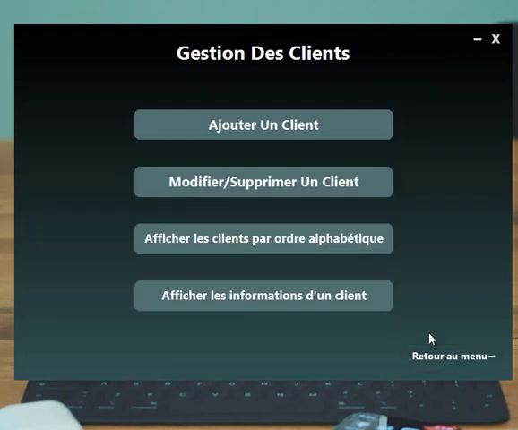
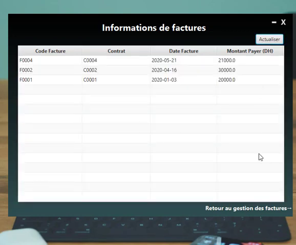

# V-Location
La conception et la réalisation d’une application desktop de gestion des locations de véhicules , en utilisant Java SE, JavaFX, CSS3, et MySQL.

---
Demo : https://www.youtube.com/embed/UMg81F1sLbY
---
Screenshots

